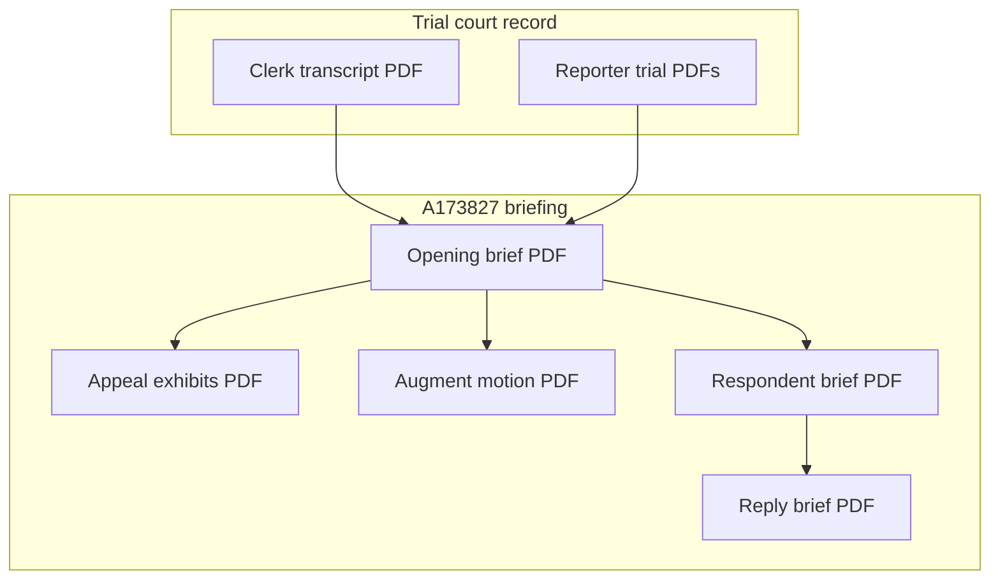

# Appeal - A173827 (review of CGC-21-594102)

**Forum:** California Court of Appeal, First Appellate District, Division Three.  
**Appellant:** Franciscus Dylan Rosario.  
**Respondents:** Subhi Abdelhalim et al. (caption as filed).

This narrative maps **what is in the appeal folder PDFs**, how those PDFs **cite** the clerk’s and reporter transcripts, and where to read **defense responses** when they are added to the public index.

---

## 1. Indexed appeal PDFs (earliest → latest)

| # | Instrument | PDF | Neutral “why filed” |
|---|------------|-----|---------------------|
| 1 | Appellant’s Opening Brief | [01-Appellants-Opening-Brief.pdf](../01-APPEAL/01-Appellants-Opening-Brief.pdf) | Plaintiff’s opening error catalog and requested relief. |
| 2 | Cover Letter | [02-Cover-Letter.pdf](../01-APPEAL/02-Cover-Letter.pdf) | Transmittal and administrative correspondence to the appellate court. |
| 3 | Proof of Electronic Service | [03-Proof-of-Electronic-Service.pdf](../01-APPEAL/03-Proof-of-Electronic-Service.pdf) | Service record for parties and counsel. |
| 4 | Response to Court Letter / Request to Augment | [04-Response-to-Court-and-Request-to-Augment.pdf](../01-APPEAL/04-Response-to-Court-and-Request-to-Augment.pdf) | Plaintiff response to court inquiries; augmentation request for record materials. |
| 5 | Appellant’s Supplemental Memorandum | [05-Appellants-Supplemental-Memorandum.pdf](../01-APPEAL/05-Appellants-Supplemental-Memorandum.pdf) | Supplemental argument filed in support of augmentation. |
| 6 | Motion to Augment Record | [06-Motion-to-Augment-Record.pdf](../01-APPEAL/06-Motion-to-Augment-Record.pdf) | Formal motion to add materials to the appellate record. |
| 7 | Appeal Exhibits (combined) | [07-Appeal-Exhibits.pdf](../01-APPEAL/07-Appeal-Exhibits.pdf) | Combined exhibit volume supporting the briefs. |
| 8 | Respondent's Opening Brief | [08-Respondents-Opening-Brief.pdf](../01-APPEAL/08-Respondents-Opening-Brief.pdf) | Defense answering brief (dated August 3, 2026). |
| 9 | Appellant's Reply Brief | [09-Appellants-Reply-Brief.pdf](../01-APPEAL/09-Appellants-Reply-Brief.pdf) | Plaintiff's reply (proof of service August 20, 2026). |
| 10 | Motion to Disregard / Strike extra-record matter | [10-Motion-to-Disregard-RB.pdf](../01-APPEAL/10-Motion-to-Disregard-RB.pdf) | Asks the court to disregard or strike matter outside the record. |
| 11 | Supplemental Request for Judicial Notice | [11-Supplemental-RJN.pdf](../01-APPEAL/11-Supplemental-RJN.pdf) | Judicial-notice application filed with the reply wave. |
| 12 | Consolidated Exhibits (reply wave) | [12-Consolidated-Exhibits.pdf](../01-APPEAL/12-Consolidated-Exhibits.pdf) | Exhibit volume supporting the reply, motion, and RJN. |
| 13 | Proposed Order (disregard) | [13-Proposed-Order-Disregard-RB.pdf](../01-APPEAL/13-Proposed-Order-Disregard-RB.pdf) | Proposed order on the disregard / strike motion. |
| 14 | Proposed Order (supplemental RJN) | [14-Proposed-Order-SRJN.pdf](../01-APPEAL/14-Proposed-Order-SRJN.pdf) | Proposed order on the supplemental RJN. |
| 15 | Respondent's Opposition to Motion to Disregard | [15-Respondents-Opposition-Motion-to-Disregard.pdf](../01-APPEAL/15-Respondents-Opposition-Motion-to-Disregard.pdf) | Defense opposition to paper 10 (September 1, 2026 signature; Court of Appeal received watermark; no face FILE date or envelope ID). |

**Index hub:** [../01-APPEAL/INDEX.md](../01-APPEAL/INDEX.md). **August 20 hub:** [../01-APPEAL/aug20-2026-reply/README.md](../01-APPEAL/aug20-2026-reply/README.md). **September 1 hub:** [../01-APPEAL/sept1-2026-respondents-opp-disregard/README.md](../01-APPEAL/sept1-2026-respondents-opp-disregard/README.md).

---

## 2. Grounds checklist (labels only: from the index)

The appeal index lists **instructional**, **evidentiary**, **juror misconduct**, **procedural/due process**, and **structural/cumulative** categories. Each category is a **heading** in the opening brief, not a court holding.

---

## 3. Key record citations table (copied as pointers)

The index’s “Key Record Citations” table names **CT** and **RT** locations for discrete events (911 exclusion, defense statements, jury questions, mistrial motion, JNOV, trial minutes, deliberate-jury-question anchor). Open those **volumes** at the cited pages in:

- [Clerk’s transcript PDF](../05-TRANSCRIPTS/CLERKS-TRANSCRIPT/CGC-21-594102-A173827-Clerks-Transcript-Full.pdf)
- Reporter PDFs for trial days linked in [01-UNDERLYING-CGC-21-594102.md](01-UNDERLYING-CGC-21-594102.md)

---

## 4. Standards of review (primer from index)

The index includes a **standards of review** table mapping **error types** to **de novo**, **abuse of discretion**, or **substantial evidence** review. That table is a **study aid**; the **Opening Brief** applies the standards to specific facts.

---

## 5. Augmentation strategy (paper purpose)

Augmentation motions exist because the **clerk’s transcript** prepared for appeal may **omit** or **truncate** images that a party believes are necessary to **decide** issues raised in the brief. The **motion to augment** and **supplemental memorandum** should be read as a **pair**: the motion states **what** is missing; the memorandum states **why** it matters to an assigned issue.

---

## 6. Relationship to equity case 631801

The appeal asks for **ordinary** appellate relief from a final judgment. The **631801** equity action asks for **vacatur** based on **extrinsic fraud** theories. They are **parallel** remedies with **different** standards and **different** judges eventually, but they **read the same transcripts**. When a fact is disputed, compare **appellate** characterization in the opening brief to **equity** characterization in [03-Memorandum-Fraud-on-Court.pdf](../02-CASE-CGC-25-631801/03-Memorandum-Fraud-on-Court.pdf).

---

## 7. Relationship to UCL case 631802

The **631802** case is **not** the appeal, but **631802** memoranda sometimes cite **trial transcripts** as **corroboration** for investigative completeness arguments. Treat those citations as **631802** arguments, not as **appellate** issues unless the opening brief also raises them.

---

## 8. Vertical diagram - appeal inputs

---

## 9. Plaintiff’s filed positions (where to read them)

| Topic | PDF |
|-------|-----|
| Full error catalog | [01-Appellants-Opening-Brief.pdf](../01-APPEAL/01-Appellants-Opening-Brief.pdf) |
| Reply to respondent | [09-Appellants-Reply-Brief.pdf](../01-APPEAL/09-Appellants-Reply-Brief.pdf) |
| Extra-record motion | [10-Motion-to-Disregard-RB.pdf](../01-APPEAL/10-Motion-to-Disregard-RB.pdf) |
| Augmentation necessity | [06-Motion-to-Augment-Record.pdf](../01-APPEAL/06-Motion-to-Augment-Record.pdf), [05-Appellants-Supplemental-Memorandum.pdf](../01-APPEAL/05-Appellants-Supplemental-Memorandum.pdf) |

---

## 10. Defense filed positions in this folder

Respondent's Opening Brief is mirrored as [08-Respondents-Opening-Brief.pdf](../01-APPEAL/08-Respondents-Opening-Brief.pdf) (dated August 3, 2026). Compare headings there to appellant's reply headings in [09-Appellants-Reply-Brief.pdf](../01-APPEAL/09-Appellants-Reply-Brief.pdf). The appellate court's **online docket** for **A173827** remains the check for later letters or orders.

---

## 11. Extended notes on instructional error (neutral)

Appellate **instructional** arguments typically compare **given** instructions to **requested** instructions found in the clerk’s transcript’s **instruction conference** section. The opening brief PDF will quote **CACI** numbers and **modified** language; those quotes must be **checked** against the **final** instruction set stamped into the clerk’s record because **late** edits sometimes occur on the morning of charging.

---

## 12. Extended notes on evidentiary error (neutral)

**911** and **body-worn camera** issues on appeal usually bundle **foundational**, **hearsay**, **authentication**, and **prejudice** sub-issues. The reporter transcript shows **live** objections; the clerk’s transcript shows **orders** on MILs. Read **both** registers before accepting any one-sentence summary of “exclusion.”

---

## 13. Juror misconduct and § 1150 (process description)

California **Evidence Code § 1150** limits **impeachment** of verdicts to **non-subjective** juror statements about **misconduct**. The opening brief’s **misconduct** section should be read with the **hearing** transcript pages where the trial court **ruled** on any **post-verdict** juror inquiries, if those pages are part of the appellate record.

---

## 14. Cumulative error (framing only)

**Cumulative error** arguments ask an appellate court to treat multiple **non-reversible** errors as **collectively reversible**. The strength of that argument is **contextual** and depends on the **entire** record. This narrative does not score the argument; it points to where plaintiff **made** it: the opening brief PDF.

---

## 15. Oral argument (future placeholder)

If and when oral argument is scheduled, the Court of Appeal’s **calendar** will list it. This static folder may not update automatically; verify the **court site** on the day of travel.

---

## 16. Record citations discipline for researchers

When you paste a cite into a memo, paste **(1)** the **PDF name**, **(2)** the **volume**, **(3)** the **page**, and **(4)** the **line** if your cite style requires lines. The appeal index gives **examples**; your own cite must match **your** PDF pagination.

---

## 17. Exhibits volume size and download tips

[07-Appeal-Exhibits.pdf](../01-APPEAL/07-Appeal-Exhibits.pdf) may be large. Download on **Wi-Fi**; use **PDF search** for keywords like **“MIL”**, **“911”**, or **“body”** to jump inside the bundle.

---

## 18. Relationship to bar complaints

Bar complaints in [../06-EVIDENCE/](../06-EVIDENCE/INDEX.md) are **not** appellate record materials unless **incorporated** by reference in a filed brief (rare). They are **parallel accountability** documents.

---

## 19. Timeline shortcut

[../timelines/appeal-A173827.md](../timelines/appeal-A173827.md)

---

## 20. How respondents' briefing is mirrored

The sequence on this site is now: opening -> respondent's brief -> reply, plus the August 20 companion motion and RJN. Each instrument is stored under `01-APPEAL/` with the next free number and a one-line entry in [../01-APPEAL/INDEX.md](../01-APPEAL/INDEX.md). Later letters or orders should be added the same way. Until a new instrument appears here, researchers should still check the **court docket** for anything filed after August 20, 2026.

---

## 21. Waiver and forfeiture concepts (dictionary only)

Appellate briefing often discusses **forfeiture** (failure to preserve) versus **waiver** (intentional relinquishment). Those words have **technical** meanings in California appellate practice. If the opening brief uses them, read the **paragraph** that contains the word and **compare** the cited trial transcript page for a **contemporaneous objection**.

---

## 22. Harmless-error paragraphs

Even when error is **found**, appellate courts sometimes **affirm** if the reviewing court concludes the error was **harmless** under **Chapman**/**People v. Watson** standards applicable in civil cases (see opening brief’s own harmless-error discussion if present). This narrative does not apply those tests; it notes they exist.

---

## 23. Record augmentation vs motion to correct

Some courts distinguish **augmentation** (add material) from **correction** (fix a mis-labeled image). The **motion** PDF title controls which tool the appellant chose.

---

## 24. Appendix authorities

If the opening brief includes a **separate authorities appendix**, it may be bound **inside** the same PDF or **outside**; check the **table of contents** page in [01-Appellants-Opening-Brief.pdf](../01-APPEAL/01-Appellants-Opening-Brief.pdf).

---

## 25. Transcript ordering costs (practical note)

Clerk’s transcripts cost money to **order** and **bind**. The PDF here is a **snapshot**; pagination should match the **set** the Court of Appeal received. If pagination **drifts**, use **heading search** inside the PDF rather than assuming page **N** today equals page **N** in an older export.

---

## 26. Reporter transcript certification

Reporter volumes carry **certificates** of accuracy on their **covers**. When quoting for publication, note whether you are quoting from a **certified** volume or a **draft** text file if one exists locally (not in this folder).

---

## 27. Sealed materials flag

If any **sealed** materials were lodged in the trial court, they may **not** appear in the public appellate PDF set. Absence from this folder does not prove absence from the **court’s** internal record.

---

## 28. Amicus participation (future)

Third parties may file **amicus** letters with leave. Track the docket if your research question is **policy-heavy**.

---

## 29. Remittitur and mandate (post-decision mechanics)

After a decision, **remittitur** issues and the **trial court** executes the mandate. Those **post-appellate** steps will appear in the **clerk’s** register for **CGC-21-594102** when they occur.

---

## 30. Cross-link to fatal-proof analysis annex

Plaintiff-authored analytical catalog: [../08-LEGAL-ANALYSIS/FATAL-PROOF-NAVARATNASINGHAM-DOLAN-ADMISSION-EXTRINSIC-FRAUD.md](../08-LEGAL-ANALYSIS/FATAL-PROOF-NAVARATNASINGHAM-DOLAN-ADMISSION-EXTRINSIC-FRAUD.md). Label in mind: **analysis**, not a court order.

---

## 31. Issue selection and page limits

Appellate briefs must **select** issues worth briefing; not every trial objection becomes a **separate** appellate heading. If a reader cannot find a favorite trial moment in the opening brief, it may have been **strategically omitted** or **bundled** under cumulative error. The **table of contents** in [01-Appellants-Opening-Brief.pdf](../01-APPEAL/01-Appellants-Opening-Brief.pdf) is the authoritative outline.

---

## 32. Record dates vs filing dates

The **file-stamp** dates on appellate PDFs differ from the **events** they discuss. When building a **timeline**, tag each event as **(A)** occurrence date, **(B)** trial order date, **(C)** notice of appeal date, **(D)** brief filing date. Mixing those layers produces **false chronologies**.

---

## 33. Oral-argument appendix (if any)

Some courts allow **focus** letters before oral argument. If such a letter exists later, store it with a numbered filename and index row like other appeal PDFs.

---

## 34. Procedural default doctrines (non-exhaustive list)

**Invited error**, **procedural default**, and **lack of prejudice** are recurring **defense** headings on appeal. When respondents’ brief arrives, expect those labels near **evidentiary** issues. Compare **defense** headings to **plaintiff** reply headings if a reply is filed.

---

## 35. Special verdict alignment

Special verdict **answers** should be read next to **jury questions** on the reporter transcript for the deliberation day. The appeal brief may argue **inconsistency** or **confusion**; verify by **laying the pages side-by-side**.

---

## 36. Expert reliance and Kelly/Frye (if raised)

If the opening brief challenges **expert methodology**, it may cite **Kelly**/**Sargon**-line cases depending on year and drafting style. Treat those cites as **legal arguments** requiring **case law reading**, not as **automatic** exclusions.

---

## 37. Costs and sanctions on appeal

Post-judgment **cost** motions sometimes continue in the trial court while appeal proceeds. Watch the **clerk’s** register for **cost** orders that might not be **central** to liability but can affect **enforcement**.

---

## 38. Media coverage vs record

News articles may **mis-caption** parties or **mis-state** vote splits. Always **prefer** the **Day 11** reporter PDF and **clerk’s** verdict order over journalism.

---

## 39. Parallel FOIA / CPRA materials

Public records obtained outside litigation may **not** be in the appellate record unless **augmented**. If plaintiff argues **new** documents, check whether the **augment motion** lists them.

---

## 39A. Internal citation conventions inside the opening brief

Appellate writers often use **“RT”** for reporter’s transcript, **“CT”** for clerk’s transcript, **“A”** for appendix, and **“ER”** for joint exhibit record volumes if the court used a joint appendix. Match the **legend** page at the opening brief’s front because **abbreviations** are not uniform across firms.

---

## 39B. Electronic filing timestamps

The **proof of service** PDF may show **UTC** timestamps or **local** times depending on the e-filing vendor. Use **file-stamp** pages as the **official** filing time for **deadline** math.

---

## 39C. Redaction obligations

If any **minor** or **medical** identifier was redacted in the public appellate PDF, do not **reconstruct** it from other sources when publishing your own derivative chart.

---

## 39D. Word-search tips inside combined exhibit PDFs

If the combined exhibits PDF is **image-only** without OCR, use **Adobe OCR** locally or rely on **separate** text PDFs if the party filed them. Search failure does not mean the **topic** is absent; it can mean the PDF is **not text-searchable**.

---

## 40. Disclaimer

No legal advice.

---

## Document metadata

| Field | Value |
|-------|-------|
| Created | 2026-07-10 |
| Last updated | 2026-04-19 |
| Last author | soltrinox |
| Version | `0ce2e6d` (rev 1) |
| Repository | GITHUB-PAGE |

*Auto-generated from git history. Re-run `scripts/audit_strategic_docs.py --apply` to refresh.*
[← Narrative hub](00-OVERVIEW.md) · [↑ SPINE](../SPINE.md) · [↑ Homepage](../README.md)
