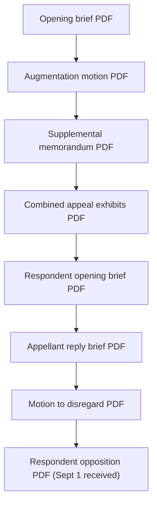

# Timeline - appeal A173827

| Item | PDF |
|------|-----|
| Opening brief | [01-Appellants-Opening-Brief.pdf](../01-APPEAL/01-Appellants-Opening-Brief.pdf) |
| Cover letter | [02-Cover-Letter.pdf](../01-APPEAL/02-Cover-Letter.pdf) |
| Proof of service | [03-Proof-of-Electronic-Service.pdf](../01-APPEAL/03-Proof-of-Electronic-Service.pdf) |
| Response / augment request | [04-Response-to-Court-and-Request-to-Augment.pdf](../01-APPEAL/04-Response-to-Court-and-Request-to-Augment.pdf) |
| Supplemental memorandum | [05-Appellants-Supplemental-Memorandum.pdf](../01-APPEAL/05-Appellants-Supplemental-Memorandum.pdf) |
| Motion to augment | [06-Motion-to-Augment-Record.pdf](../01-APPEAL/06-Motion-to-Augment-Record.pdf) |
| Appeal exhibits | [07-Appeal-Exhibits.pdf](../01-APPEAL/07-Appeal-Exhibits.pdf) |
| Respondent's opening brief (Aug 3, 2026) | [08-Respondents-Opening-Brief.pdf](../01-APPEAL/08-Respondents-Opening-Brief.pdf) |
| Appellant's reply brief (Aug 20, 2026) | [09-Appellants-Reply-Brief.pdf](../01-APPEAL/09-Appellants-Reply-Brief.pdf) |
| Motion to disregard extra-record matter | [10-Motion-to-Disregard-RB.pdf](../01-APPEAL/10-Motion-to-Disregard-RB.pdf) |
| Supplemental RJN | [11-Supplemental-RJN.pdf](../01-APPEAL/11-Supplemental-RJN.pdf) |
| Consolidated exhibits (reply wave) | [12-Consolidated-Exhibits.pdf](../01-APPEAL/12-Consolidated-Exhibits.pdf) |
| Proposed order (disregard) | [13-Proposed-Order-Disregard-RB.pdf](../01-APPEAL/13-Proposed-Order-Disregard-RB.pdf) |
| Proposed order (supplemental RJN) | [14-Proposed-Order-SRJN.pdf](../01-APPEAL/14-Proposed-Order-SRJN.pdf) |
| Respondent opposition to motion to disregard (Sept 1, 2026; received watermark) | [15-Respondents-Opposition-Motion-to-Disregard.pdf](../01-APPEAL/15-Respondents-Opposition-Motion-to-Disregard.pdf) |

**Index:** [../01-APPEAL/INDEX.md](../01-APPEAL/INDEX.md). **August 20 hub:** [../01-APPEAL/aug20-2026-reply/README.md](../01-APPEAL/aug20-2026-reply/README.md). **September 1 hub:** [../01-APPEAL/sept1-2026-respondents-opp-disregard/README.md](../01-APPEAL/sept1-2026-respondents-opp-disregard/README.md).

## Vertical diagram

[← Homepage](../README.md) · [Narrative chapter](../narrative/02-APPEAL-A173827.md)
